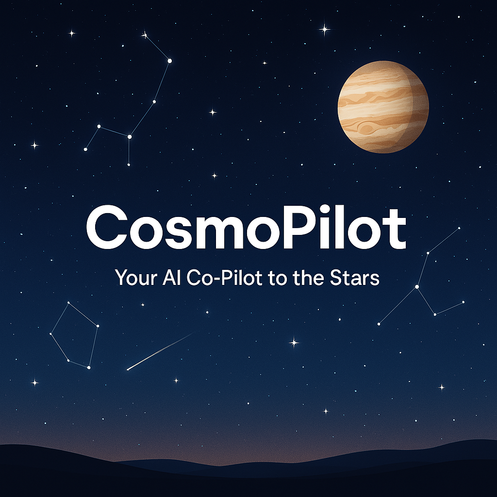

# 🌌 CosmoPilot

**Your AI-Powered Co-Pilot to the Cosmos — Real-Time, 3D, and Beautiful.**

CosmoPilot is a next-gen stargazing platform that transforms your device into a real-time celestial observatory. With AI guidance, accurate planetary positions, and immersive 3D visualizations, you can explore the night sky like never before — from any location, across any time in history.

---

## 🚀 Features

- 🔭 **Real-Time Night Sky Visualizer**  
  Explore planets, stars, and constellations in a stunning 3D sky from your coordinates.

- 🧠 **AI Astronomer Assistant (powered by GPT)**  
  Ask questions like "Where is Jupiter right now?" or "Show me Orion" — and CosmoPilot will guide you.

- 🕒 **Time Travel Mode**  
  View the sky as it appeared 100 years ago — or how it will look 200 years into the future.

- 📷 **Sky Simulation & Celestial Angles**  
  See exactly how a planet or meteor would appear from your location at a given azimuth and altitude.

- 🌘 **Live Eclipse Tracker & 3D Simulation**  
  Know when an eclipse is happening, view it in real-time with accurate shadow visuals.

- 📡 **Coordinate Calibration System**  
  Guides the user if they’re looking at the wrong part of the sky — using arrows and angle corrections.

- 🌦️ **Microclimate + Light Pollution Alerts** *(coming soon)*  
  Know if the sky conditions are ideal for stargazing from your location.

---

## 🖼️ Preview (Coming Soon)

> “CosmoPilot is not just a stargazer — it's your time machine, cosmic guide, and personal AI astronomer.”

---

## 🛠️ Tech Stack

- 🌌 **Frontend**: React + Three.js  
- 🔮 **AI Assistant**: OpenAI GPT / Gemini APIs  
- 🔭 **Astronomy Calculations**: Python (Skyfield, AstroPy)  
- 📡 **Backend**: FastAPI or Flask  
- ☁️ **Hosting**: Vercel / GitHub Pages / Railway  
- 🧠 **Optional AI Models**: On-device inference (WebGPU), Whisper (for voice), HuggingFace Transformers

---

## 📦 Installation

Coming soon!

---

## 🧠 Future Features

- 🎙️ Voice-controlled sky navigation  
- 🌍 AR view of sky using phone camera  
- 📅 Stargazing event calendar  
- ☁️ Real-time weather overlay  
- 🔧 Plugin support for custom telescopes

---

## 👨‍🚀 Author

Made with love by **Ansh Agarwal**  
[GitHub](https://github.com/anshhhcodes) • [LinkedIn](https://www.linkedin.com/in/anshhhagarwal) • [Email](anshhhworks@gmail.com)

---
